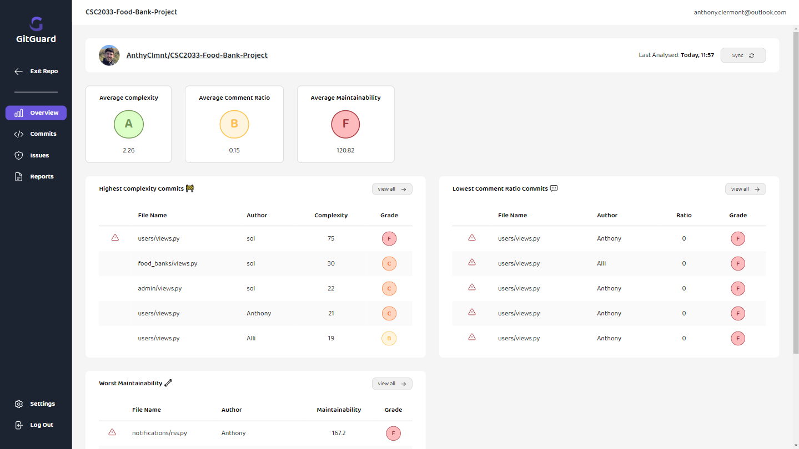
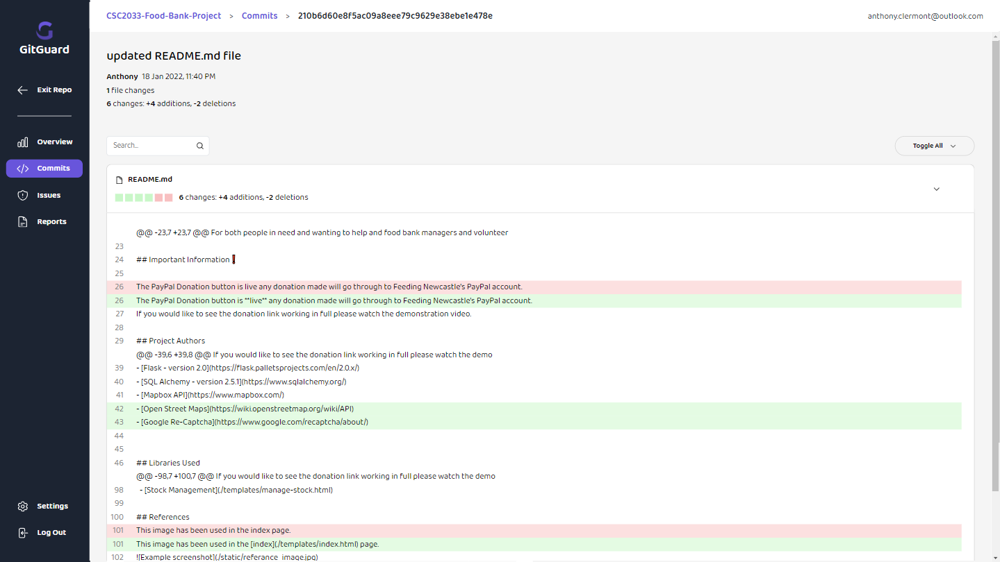
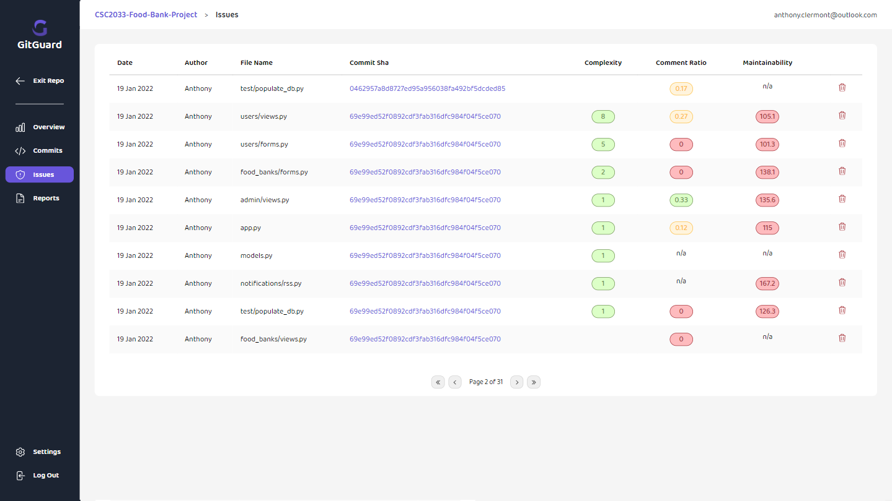
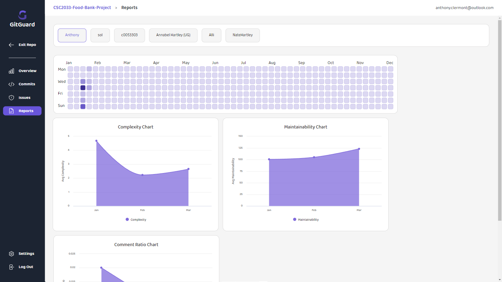

# GitGuard Front-end

This project is the front-end application for my University dissertation. It is a web-based application for determining contributors' code quality. All components are hand-written and the interface doesn't utilise any UI libraries.

### 🚨 This project is still being developed and is a WIP

The dissertation can be read here: [Dissertation PDF](./src/assets/readme/Anthony%20Clermont%20-Dissertation.pdf)
